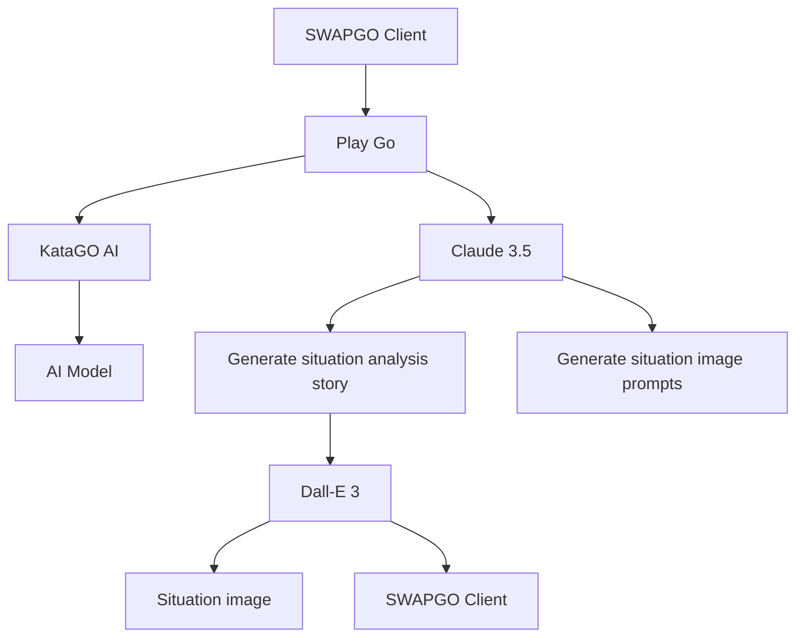

# SwapGo: The Intelligent Narrative Revolution in Go

## Project Introduction

SwapGo is an innovative Go project aimed at transforming the traditional black and white game into an adventure filled with stories and emotions. By combining Go with advanced Artificial Intelligence Language Models (AI-LLM), we bring life and meaning to every move.

As the game progresses, AI generates real-time story scenes and character dialogues corresponding to the game situation, immersing players and spectators in a dynamically changing narrative world. This is not just a game of Go, but a wonderful journey that unfolds with each stone placed, offering Go enthusiasts an unprecedented experience.

## Project Background

SwapGo is a participating project in the 2024 Claude Hackathon. In an era where AI Go programs have surpassed human abilities, we consider how to use AI technology to create new possibilities for the field of Go.

Our inspiration comes from the essence of Go—military simulation. SwapGo uses AI to simulate war scenarios, allowing players to experience the depth of strategy and tactics while playing. Through this innovative approach, we hope not only to enrich the Go gaming experience but also to help people understand the complexity of war more deeply, thereby promoting the idea of peace.

## System Architecture

## Demonstration

We provide an online demonstration website for SwapGo. Please note the following:

- The demo site supports a maximum of 2 users simultaneously due to performance considerations.
- We cannot guarantee continuous availability of the demo site.
- Your understanding and patience are greatly appreciated.

[Online Demo Website Link](https://go.swap.work/SWAPGO/start)

## Local Setup

To ensure the best experience, we recommend running SwapGo locally. Please follow these steps to set up:

1. Clone the repository: `git clone [Repository URL]`
2. Install dependencies: `pip install -r requirements.txt`
3. Set up your API key: `export OPENAI_API_KEY='your-api-key-here'`
4. Run the program: `python main.py`

## Technologies and Resources Used

### Go AI
- [KataGo](https://github.com/lightvector/KataGo): Used for simulating opponents

### Music Resources
- [Age of Empires II: Definitive Edition Soundtrack](https://www.youtube.com/playlist?list=PLh4Eme5gACZFflgnk-qzmDGWroz2EIqi8)
- [Dune - Game of Thrones Style Intro](https://www.youtube.com/watch?v=VlPIBlr0VCs)
- [Age of Empires 2 Definitive Edition - Japanese theme](https://www.youtube.com/watch?v=rCr_p3N5qso)

### Image Generation
- [OpenAI DALL-E 3](https://platform.openai.com/docs/guides/images)

## Contribution

We welcome community contributions! If you have any ideas for improvements or find any bugs, please don't hesitate to submit an issue or pull request.

## License

This project is licensed under the [MIT License](LICENSE).

---

SwapGo - Redefining the Go experience, ushering in a new era of intelligent narrative.
