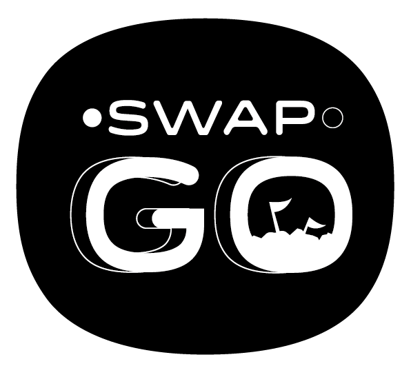
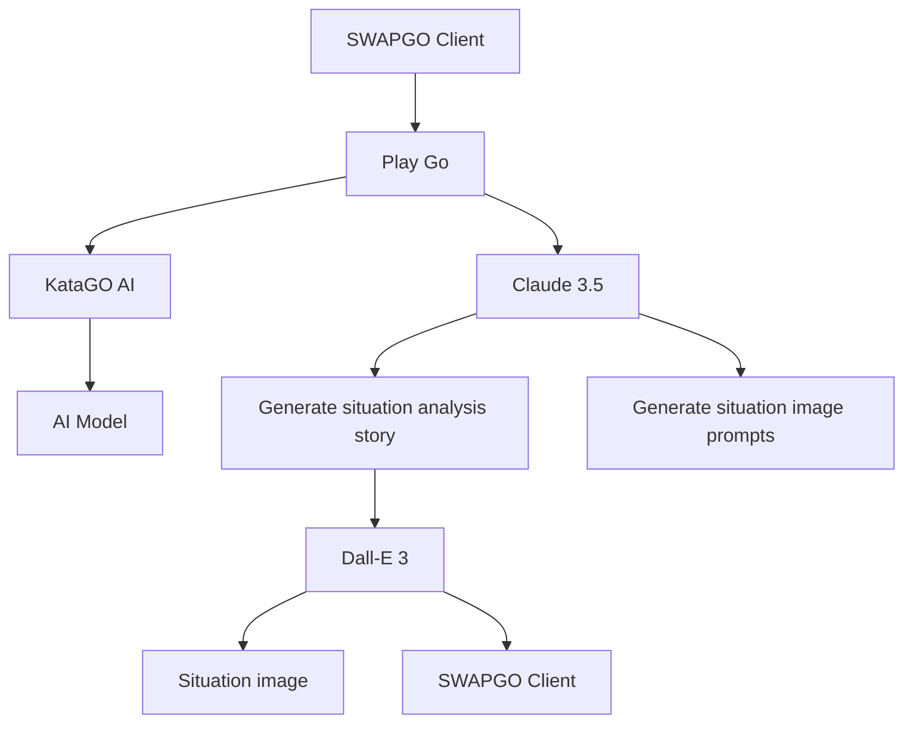
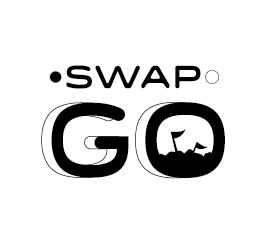

# SwapGo: The Intelligent Narrative Revolution in Go



Screenshots

<table>
  <tr>
    <td></td>
    <td></td>
    <td></td>
  </tr>
</table>


  🎬 🍿 Click the image below to watch our `DEMO VIDEO` 👇

<table>
  <tr>
    <td>
      <a href="https://www.youtube.com/watch?v=on3ye7jCcRg">
        
      </a>
    </td>
  </tr>
</table>

<br>

## Project Introduction

SwapGo is an innovative Go project aimed at transforming the traditional black and white game into an adventure filled with stories and emotions. By combining Go with advanced Artificial Intelligence Language Models (AI-LLM), we bring life and meaning to every move.

As the game progresses, AI generates real-time story scenes and character dialogues corresponding to the game situation, immersing players and spectators in a dynamically changing narrative world. This is not just a game of Go, but a wonderful journey that unfolds with each stone placed, offering Go enthusiasts an unprecedented experience.

<br>

## Project Background

SwapGo is a participating project in the [&#34;Build with Claude June 2024 contest&#34;](https://docs.anthropic.com/en/build-with-claude-contest/overview). In an era where AI Go programs have surpassed human abilities, we consider how to use AI technology to create new possibilities for the field of Go.

Our inspiration comes from the essence of Go—military simulation. SwapGo uses AI to simulate war scenarios, allowing players to experience the depth of strategy and tactics while playing. Through this innovative approach, we hope not only to enrich the Go gaming experience but also to help people understand the complexity of war more deeply, thereby promoting the idea of peace.

<br>

## System Architecture



<br>

## Demonstration

Please contact us support@yosgo.com to get demo site. 

- The demo site supports a maximum of 2 users simultaneously due to performance considerations.
- We cannot guarantee continuous availability of the demo site.
- Your understanding and patience are greatly appreciated.

<br>

## Local Setup

To ensure the best experience, we recommend running SwapGo locally. Please follow these steps to set up:

### KataGo AI Setup

1. **KataGo Executable**: Download the appropriate version for your operating system from [KataGo Binary](https://github.com/lightvector/KataGo/releases).
2. **Model Parameter File**: Download the v1.4.0 model parameter file from [KataGo Neural Nets](https://github.com/lightvector/KataGo/releases/tag/v1.4.0).
3. **Python Main File** (`ana.py`):
   Modify line 34 to match your local file locations:

   ```python
   katago = subprocess.Popen(
       ["./katago", "analysis", "-config", "./ana.cfg", "-model", "./g170e-b20c256x2-s5303129600-d1228401921.bin.gz", *additional_args],
       stdin=subprocess.PIPE,
       stdout=subprocess.PIPE,
       stderr=subprocess.PIPE,
   )
   ```

   Replace `./katago`, `./ana.cfg`, and `./g170e-b20c256x2-s5303129600-d1228401921.bin.gz` with the correct paths on your system.
4. **KataGo Configuration File** (`ana.cfg`)
5. **API Server** (`give.js`)

Place all files in the same directory.

The default API URL is `http://localhost:3031/ana`.

### Client Server

This project uses [Next.js](https://nextjs.org/).

#### Requirements

- Node.js version 18 or higher

#### Running the Web Server

Execute the following command:

```
yarn dev
```

Access the web interface at `http://localhost:3000`

Additional Configuration
In the go.js file, modify line 239 to change the production URL to the local API URL

```diff-javascript
- await axios.post(`https://swapgo.yosgo.com/ana`, {
+ await axios.post(`http://localhost:3031/ana`, {
  moves: payload,
})
```

Ensure this change is made to connect the client to your local KataGo AI server.

<br>

## Technologies and Resources Used


### Go AI

- [KataGo](https://github.com/lightvector/KataGo): Used for simulating opponents

### Music Resources

- [Angel Lover - Eyes of Glory](https://www.youtube.com/watch?v=jZSquuCHVZA)

### Image Generation

- [OpenAI DALL-E 3](https://platform.openai.com/docs/guides/images)

<br>

## Contribution

We welcome community contributions! If you have any ideas for improvements or find any bugs, please don't hesitate to submit an issue or pull request.

👉 swap@yosgo.com

<br>

---

SwapGo - Redefining the Go experience, ushering in a new era of intelligent narrative.
